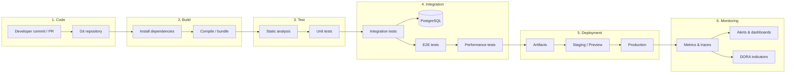
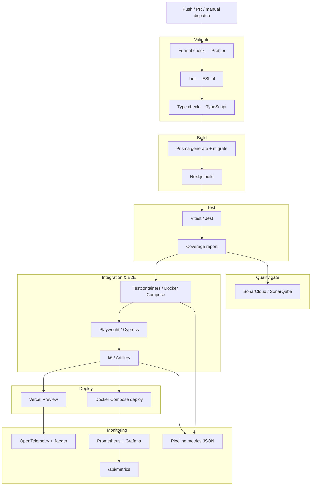
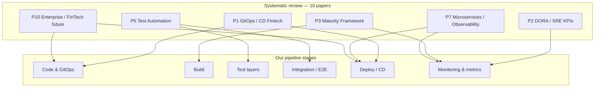
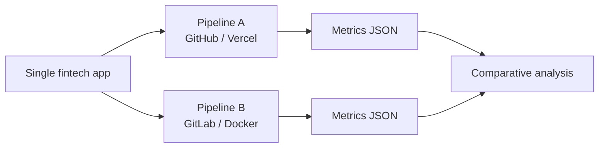

# DevOps Pipeline — Week 09

**Group 01**  
**Title:** Using metrics in integration testing to optimize change validation time in DevOps pipelines in Fintech systems  
**Authors:** Gabriel Alves, Matheus Emanoel, Sara Cristina  
**Date:** 2026/06/08

---

## Abstract

This document presents the conceptual DevOps pipeline designed for our fintech experiment. The pipeline follows the classic flow **Code → Build → Test → Integration → Deployment → Monitoring**, adapted to the reliability, auditability, and regulatory requirements typical of financial systems. We describe each stage, its purpose, and how it maps to the two toolchains implemented in the repository (Pipeline A — GitHub/Vercel and Pipeline B — GitLab/Docker). Each stage is grounded in findings from our systematic review.

**Keywords:** DevOps; CI/CD; pipeline; integration testing; fintech; DORA; monitoring; deployment; systematic review.

---

## 1. Conceptual pipeline (high level)

In a fintech context, every change to the codebase must pass through automated gates before reaching production. The pipeline acts as a **change validation funnel**: fast feedback on syntax and unit logic, deeper checks on data and business rules, and finally deployment with continuous observability.



### Stage summary

| Stage | Goal | Fintech relevance |
|-------|------|-------------------|
| **Code** | Version and review changes | Audit trail, pull-request gates |
| **Build** | Produce a deployable artifact | Reproducible builds, dependency pinning |
| **Test** | Catch defects early (lint, types, unit) | Business rules (balances, transfers) |
| **Integration** | Validate against real dependencies | DB transactions, auth, audit logs |
| **Deployment** | Release to target environment | Controlled rollout, rollback capability |
| **Monitoring** | Observe health and delivery performance | DORA metrics, incident detection |

---

## 2. Detailed pipeline for the fintech experiment

Our experimental application is a simulated fintech (accounts, deposits, transfers, audit trail) built with **Next.js**, **Prisma**, and **PostgreSQL**. The pipeline validates financial business rules before any deploy.



### 2.1 Code

- **Trigger:** push to `main`/`develop`, pull request, or `workflow_dispatch` (Pipeline A).
- **Source of truth:** single Git repository shared by both toolchains.


### 2.2 Build

- Install dependencies with **pnpm** (frozen lockfile).
- Run **Prisma** generate and database migrations.
- Build the **Next.js** application (`.next/` artifact in Pipeline B).
- **Gate:** pipeline stops if build fails (scenario C3).

### 2.3 Test (unit & static)

| Check | Tool | Blocks pipeline? |
|-------|------|------------------|
| Formatting | Prettier | Yes |
| Lint | ESLint | Yes (A); optional fail (B) |
| Types | `tsc --noEmit` | Yes |
| Unit tests | Vitest (A) / Jest (B) | Yes |
| Coverage | Vitest / Jest reporters | Collected; used in analysis |

Unit tests cover money handling (`Decimal`), validations (Zod), and core business rules in `src/server/services/`.

### 2.4 Integration

| Layer | Pipeline A | Pipeline B | Validates |
|-------|------------|------------|-----------|
| Integration | Testcontainers + PostgreSQL | Docker Compose + PostgreSQL | Transactions, balances, audit |
| E2E | Playwright | Cypress | Register, login, deposit, transfer |
| Performance | k6 (`k6/scenarios.js`) | Artillery (`artillery/fintech.yml`) | Latency, error rate under load |

**Key experiment insight:** scenario **C2** (balance bug) is designed to pass unit tests but fail integration/E2E — measuring which pipeline detects the defect.

### 2.5 Deployment

| Pipeline | Platform | Mechanism | When |
|----------|----------|-----------|------|
| **A** | GitHub Actions | Vercel Preview | PR only (optional) |
| **B** | GitLab CI | `docker compose --profile deploy-b` | Manual stage |

Deployment is non-blocking in the academic setup when secrets are absent; the focus is on **validation before deploy**, not production release.

### 2.6 Monitoring

Observability closes the DevOps loop and feeds **DORA-aligned metrics** (`docs/metrics.md`):

| Signal | Pipeline A | Pipeline B |
|--------|------------|------------|
| Traces | OpenTelemetry + Jaeger | — |
| Metrics | Step Summary + JSON export | Prometheus + Grafana |
| App metrics | `/api/metrics` | `/api/metrics` |
| CI metrics | `experiment-results/pipeline-a-*.json` | `experiment-results/pipeline-b-*.json` |

Tracked metrics include total pipeline time, per-stage duration, coverage %, test pass/fail, and (in production-like runs) lead time and change failure rate.

---

## 3. Literature alignment

Our pipeline design is not arbitrary: each stage reflects recommendations and evidence from the ten articles reviewed. The mapping below shows how academic findings translate into concrete pipeline decisions in this repository.



### 3.1 Summary matrix — articles × pipeline stages

| Paper | Primary pipeline stages | How our pipeline implements the literature |
|-------|-------------------------|---------------------------------------------|
| **P1** — Nagraj (2022), GitOps & CD in Financial Software | Code, Deploy, Quality | Git as single source of truth; PR-triggered CI; Sonar as DevSecOps gate; audit trail in `audit.repository`; containerized deploy in Pipeline B |
| **P2** — Daraojimba et al. (2024), DevOps/SRE KPIs | Monitoring | `PIPELINE_START`/`END` timestamps; DORA metrics in `docs/metrics.md` (lead time, change failure rate, deployment frequency); `/api/health` |
| **P3** — Oyewole et al. (2023), DevOps Maturity Framework | All stages | Multi-dimension maturity (People/Process/Technology); GitLab CI, Docker, Prometheus, Grafana, SonarQube cited in P3 — all present in Pipeline B |
| **P4** — Sakinala (2025), AI on DevOps | — (future work) | Not implemented; pipeline comparison (A vs B) lays groundwork for data-driven optimization cited in P4 |
| **P5** — Jyoti et al. (2024), Test Automation Frameworks | Test, Integration | Layered strategy: unit (Vitest/Jest) → API/integration (Testcontainers/Compose) → E2E (Playwright/Cypress); C2 proves integration layer value |
| **P6** — Adewusi et al. (2022), Metrics & OKRs | Monitoring | Pipeline metrics exported to `experiment-results/` support experiment objectives; per-stage timing enables continuous feedback loops |
| **P7** — Al-Habib & Sullaiman (2024), Microservices & Observability | Deploy, Monitoring | Docker deploy (B); Jaeger traces (A); Prometheus + Grafana (B); fintech use case explicitly referenced in P7 |
| **P8** — Argaz et al. (2023), Monolith Decomposition | Code, Deploy | Single monolithic Next.js app keeps toolchains comparable; deploy stage mirrors M2MDF "evaluation & deployment" phase |
| **P9** — Sain et al. (2025), Agile Decision-Making | Code, Test | Empirical A vs B comparison supports evidence-based toolchain choice in underexplored QA/release stages (gap identified in P9) |
| **P10** — Onyeagusi & Onyeagusi (2025), Enterprise Software Future | All stages | FinTech focus; DevOps/CI/CD as competitive advantage; regulatory compliance via automated validation before deploy |

### 3.2 Stage-by-stage literature grounding

#### Code (P1, P8, P9, P10)

- **P1** recommends GitOps: Git is the declarative source of truth for both application code and pipeline definitions (`.github/workflows/`, `.gitlab-ci.yml`).
- **P1** and **P10** stress auditability in financial software — addressed by PR gates, immutable CI logs, and the application audit log (`src/repositories/audit.repository.ts`).
- **P9** notes that decision-making during testing and release is under-researched; our controlled scenarios C0–C3 enable reproducible, evidence-based comparisons.
- **P8** keeps a single deployable monolith so Pipeline A and B validate the **same** artifact — a methodological choice aligned with fair toolchain comparison.

#### Build (P1, P3, P7)

- **P1** and **P3** highlight automated, repeatable builds as a maturity indicator; `pnpm build` with frozen lockfile ensures reproducibility.
- **P7** reports lead-time reductions when CI/CD automates build and deploy; our `step_build_seconds` metric directly measures this stage.
- **P3** lists containerization as a technology maturity dimension — Pipeline B produces a Docker image via `docker compose --profile deploy-b`.

#### Test — static & unit (P3, P5)

- **P5** concludes that layered automation (unit + API over excessive UI-only testing) improves reliability; we run lint, type check, and unit tests **before** E2E.
- **P5** warns about flaky tests and maintenance cost — mitigated by separating Vitest/Jest (fast) from Playwright/Cypress (slower, environment-dependent).
- **P3** includes SonarQube in its technology review; SonarCloud (A) and SonarQube (B) act as static quality gates.

#### Integration & E2E (P5, P1, P2)

- **P5** emphasizes API and integration layers for defect detection; scenario **C2** (balance bug) is the central experiment: unit tests pass, integration/E2E fail — validating P5's layered-testing thesis empirically.
- **P1** embeds compliance checks in the pipeline; integration tests validate transactional integrity (deposits, transfers) against a real PostgreSQL instance.
- **P2** links test outcomes to **change failure rate** — a core DORA metric we track when pipelines fail on C2/C3.

#### Performance (P2, P7)

- **P7** documents MTTD/MTTR improvements via observability; k6 and Artillery load tests simulate user traffic and expose latency/error-rate regressions before deploy.
- **P2** groups user-experience and reliability metrics; performance stage output feeds comparative analysis in `results-template.md`.

#### Deployment (P1, P3, P7, P8, P10)

- **P1** advocates Continuous Delivery with automated, repeatable releases — Vercel Preview (A) and Docker Compose deploy (B).
- **P1** case studies (ING NL, Capital One) report 20–30% deployment improvements; our experiment measures comparable gains in validation time and failure detection.
- **P7** cites deployment frequency increases from weekly to multiple per day; manual deploy in Pipeline B reflects academic scope while preserving the CD stage in the conceptual model.
- **P10** reports FinTech teams with DevOps deploy up to 24× more frequently — motivating why both pipelines include a deploy stage even when optional.

#### Monitoring & metrics (P2, P3, P6, P7)

- **P2** defines the four DORA metrics; `docs/metrics.md` maps each to a collectable signal in our pipelines (e.g. lead time = commit → green CI).
- **P3** lists Prometheus and Grafana as maturity tools — implemented in Pipeline B (`monitoring/prometheus.yml`, Grafana dashboards).
- **P7** recommends Jaeger for distributed tracing — Pipeline A uses OpenTelemetry + Jaeger (`instrumentation.ts`, `src/lib/telemetry.ts`).
- **P6** argues metrics must align with strategic objectives; our experiment OKRs (validation time vs defect detection) are operationalized through `export-pipeline-metrics.mjs` and `results-template.md`.

#### Out of scope / future work (P4)

- **P4** (AI on DevOps) discusses intelligent pipeline optimization and predictive observability. Our current design collects the metrics (timings, coverage, pass/fail) that would feed such AI-assisted tuning in a future iteration — human supervision remains central, as P4 recommends.

### 3.3 Research questions addressed by the pipeline

Cross-reference with the summary table in `article-summaries-week05.md`:

| Research angle | Supporting papers | Pipeline evidence |
|----------------|-------------------|-------------------|
| **RQ-1** — Metrics and pipeline efficiency | P2, P3, P6, P7 | Per-stage timings, DORA-aligned exports, toolchain comparison |
| **RQ-2** — Tooling and organizational maturity | P3, P4, P6, P9, P10 | Two maturity levels (monolithic GHA job vs staged GitLab); decision support via metrics |
| **RQ-3** — Integration testing in fintech | P1, P5, P7, P8, P10 | C2 scenario, Testcontainers/Compose, audit-aware E2E flows |

---

## 4. Two toolchain variants (experiment design)

The same conceptual pipeline is implemented twice to compare trade-offs:



| Dimension | Pipeline A | Pipeline B |
|-----------|------------|------------|
| CI orchestration | Single monolithic job | Multi-stage jobs with `needs` |
| Unit runner | Vitest | Jest |
| Integration | Testcontainers | Docker Compose |
| E2E | Playwright | Cypress |
| Performance | k6 | Artillery |
| Quality | SonarCloud | SonarQube |
| Deploy | Vercel Preview | Docker image |
| Observability | Jaeger | Prometheus + Grafana |
| Config file | `.github/workflows/pipeline-a-github.yml` | `.gitlab-ci.yml` |

**Hypothesis (H1):** Pipeline B detects more integration defects (e.g. C2) at the cost of longer total runtime — supporting the research question on optimizing change validation time in fintech pipelines.

---

## 5. Pipeline flow (textual)

Linear view aligned with the course example:

```
Code → Validate → Build → Unit Test → Integration Test → E2E → Performance
  → Quality Gate → Deployment → Monitoring → Metrics Export
```

**Failure policy:** any blocking stage aborts the pipeline; artifacts and timing data are still exported (`if: always()` / `when: always`) for post-run analysis.


---

## 6. Conclusion

The conceptual DevOps pipeline for our fintech topic extends the standard **Code → Build → Test → Integration → Deployment → Monitoring** model with financial-specific gates: transactional integration tests, audit-aware E2E flows, performance checks under load, and metric collection aligned with DORA. Each stage is grounded in our Week 05 systematic review — from **P1** (GitOps/CD and DevSecOps in fintech) and **P5** (layered test automation) through **P2** and **P6** (DORA and OKR-aligned metrics) to **P7** (containerization and observability). Two concrete implementations (GitHub/Vercel vs GitLab/Docker) allow empirical comparison of validation time versus defect detection, directly addressing the research questions that motivated the literature selection.
