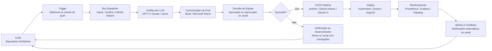
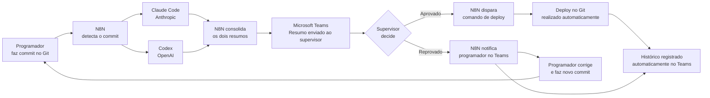

# Semana 09 – Pipeline DevOps

**Tema:**
ChatOps: Automação de tarefas DevOps através de robôs de mensagens instantâneas

**Integrantes**
- Vinicius Cristovão Bianchini Soares
- Leonardo Cavalcante
- Davi Santos de Deus

---

## 1. Objetivo da Entrega

Esta entrega apresenta um **pipeline ChatOps** aplicado ao tema do grupo, construído a partir de duas perspectivas complementares:

1. **Pipeline conceitual baseado na literatura** — estruturado a partir dos 12 artigos da revisão sistemática, representando o modelo teórico e as boas práticas identificadas na pesquisa.
2. **Pipeline real identificado** — implementação concreta e operacional de ChatOps utilizada em ambiente profissional, composta por Git, N8N, Claude Code, Codex e Microsoft Teams.

A comparação entre os dois modelos constitui a contribuição central desta entrega, demonstrando que o pipeline real valida na prática o que a literatura descreve em teoria — e em vários aspectos o supera, especialmente pela abordagem preventiva e pela simplicidade da stack.

O pipeline segue a lógica geral do ChatOps:

> **Commit → Detecção → Análise por IA → Comunicação via Chat → Decisão Humana → Deploy ou Correção → Registro**

---

## 2. Fundamentação dos Artigos para o Pipeline

Cada etapa do pipeline foi fundamentada em pelo menos um dos 12 artigos da revisão sistemática. A tabela abaixo demonstra essa rastreabilidade.

| Nº | Artigo analisado | Contribuição para o pipeline |
|---:|---|---|
| 01 | **AI-Powered ChatOps: Enhancing Collaboration in DevOps Teams** | Fundamenta o uso de bots com IA no pipeline; valida o modelo Human-in-the-Loop onde a IA sugere e o humano decide. |
| 02 | **Systematic Literature Review of Explainable LLM-Powered ChatOps for CI/CD Pipeline Diagnostics** | Fundamenta a etapa de análise por LLM; demonstra que modelos como Claude e GPT-4 analisam código e explicam problemas em linguagem natural. |
| 03 | **LLM-Powered ChatOps Approach to Microservice Deployment Pipeline Automation and Monitoring** | Fundamenta a etapa de orquestração e deploy; demonstra que comandos no chat disparam ações automatizadas de implantação e monitoramento. |
| 04 | **AI-Enhanced DevSecOps Pipelines: ChatOps, Compliance Automation, and Intelligent Incident Response** | Fundamenta a etapa de qualidade e segurança integradas ao pipeline via parâmetros configurados na IA, sem ferramentas externas separadas. |
| 05 | **DevOps 2.0: Embracing AI/ML, Cloud-Native Development, and a Culture of Continuous Transformation** | Posiciona ChatOps como componente central do DevOps moderno; valida a integração de IA ao pipeline como tendência dominante. |
| 06 | **ChatOps for Microservice Systems: A Low-Code Approach** | Fundamenta a escolha do N8N como orquestrador low-code; demonstra que abordagens visuais reduzem complexidade e democratizam o ChatOps. |
| 07 | **AI Driven ChatOps for Realtime Security Incident Response in DevSecOps** | Fundamenta a abordagem preventiva do pipeline; demonstra que detecção antecipada de problemas evita que código problemático chegue à produção. |
| 08 | **From Incident to Insight: Incident Responders and Software Innovation** | Fundamenta a etapa de registro e aprendizado; demonstra que o histórico do canal de chat gera base de conhecimento organizacional automaticamente. |
| 09 | **How Teams Are Adopting ChatOps for Incident Management** | Fundamenta o Teams como canal central de decisão; demonstra que ChatOps centraliza comunicação e ação em um único canal sem context-switching. |
| 10 | **Role of ChatOps in Incident Management** | Fundamenta a etapa de feedback automático ao programador; demonstra que o retorno imediato via chat reduz o tempo de correção. |
| 11 | **Bringing Automation to the Classroom: A ChatOps-Based Approach** | Demonstra a versatilidade do modelo ChatOps além de ambientes corporativos, validando sua aplicabilidade em diferentes contextos. |
| 12 | **Aligning DevOps and Microservice Architecture: Empirical Mapping, Taxonomy, and RAG-Based Decision Support** | Fundamenta o suporte a decisões arquiteturais via chat; demonstra que IA integrada ao canal pode recomendar boas práticas proativamente. |

---

## 3. Premissas do Pipeline

O pipeline foi estruturado com base nas seguintes premissas, derivadas da literatura e do fluxo real identificado:

1. O código-fonte deve estar versionado em repositório Git, sendo o commit o gatilho de todo o fluxo.
2. A análise do código deve ser realizada por modelos de IA antes de qualquer decisão de deploy.
3. O canal de chat (Microsoft Teams) deve ser o ponto único de comunicação, decisão e registro.
4. A decisão final de aprovação ou reprovação deve ser sempre de um humano — modelo Human-in-the-Loop.
5. O orquestrador do fluxo deve ser uma ferramenta low-code, acessível sem expertise profunda em DevOps.
6. O deploy deve ser disparado automaticamente após aprovação, sem intervenção manual adicional.
7. Em caso de reprovação, o programador deve ser notificado automaticamente no mesmo canal.
8. Todo o histórico de decisões deve ser registrado automaticamente no canal, sem esforço adicional da equipe.
9. A segurança e qualidade do código devem ser verificadas pela IA via parâmetros configurados, não por ferramentas externas separadas.

---

## 4. Pipeline Conceitual Baseado na Literatura

### 4.1 Diagrama do Pipeline Conceitual

### 4.2 Descrição das Etapas do Pipeline Conceitual

#### Etapa 1 — Code: Versionamento do Código

O código-fonte é armazenado em repositório Git (GitHub, GitLab ou Bitbucket). O commit ou pull request dispara automaticamente o pipeline.

**Fundamentação:** Artigo 08 — todo evento deve ser registrado e rastreável; o commit é o gatilho do fluxo ChatOps.

**Ferramentas da literatura:** GitHub, GitLab, Bitbucket, AWS CodeCommit.

---

#### Etapa 2 — Trigger: Detecção do Evento

Um mecanismo de detecção (webhook ou evento de repositório) identifica o novo commit e aciona o bot dispatcher.

**Fundamentação:** Artigos 03 e 09 — plataformas de chat integradas a repositórios detectam eventos e disparam fluxos automaticamente.

**Ferramentas da literatura:** Webhooks, GitHub Actions triggers, Jenkins polling.

---

#### Etapa 3 — Análise por LLM

Um modelo de linguagem (LLM) analisa o código do commit, identifica problemas, vulnerabilidades ou boas práticas violadas, e gera um resumo explicável em linguagem natural.

**Fundamentação:** Artigo 02 — LLMs analisam código e logs, identificam padrões e explicam problemas de forma compreensível para desenvolvedores e supervisores.

**Ferramentas da literatura:** GPT-4, Claude (Anthropic), Llama (Meta), RAG.

---

#### Etapa 4 — Comunicação via Chat

O resumo gerado pela IA é enviado ao canal de chat da equipe, onde o supervisor ou equipe responsável pode ler e decidir.

**Fundamentação:** Artigos 09 e 10 — ChatOps centraliza comunicação e decisão em um único canal, eliminando context-switching entre ferramentas.

**Ferramentas da literatura:** Slack, Microsoft Teams, Discord, Mattermost.

---

#### Etapa 5 — Decisão no Canal

O supervisor ou equipe aprova ou reprova o commit diretamente no canal de chat, sem precisar acessar outras ferramentas.

**Fundamentação:** Artigo 01 — modelo Human-in-the-Loop onde a IA fornece a análise e o humano toma a decisão final, garantindo maior segurança em ambientes de produção.

**Ferramentas da literatura:** Bots de aprovação no Slack/Teams, comandos interativos no canal.

---

#### Etapa 6a — Deploy (se aprovado)

Após aprovação, o pipeline de CI/CD é acionado automaticamente, executando build, testes e deploy na infraestrutura definida.

**Fundamentação:** Artigo 03 — comandos no chat disparam ações automatizadas de implantação, monitoramento e rollback.

**Ferramentas da literatura:** Jenkins, GitHub Actions, GitLab CI/CD, Kubernetes, ArgoCD, Docker.

---

#### Etapa 6b — Notificação ao Desenvolvedor (se reprovado)

Em caso de reprovação, o desenvolvedor é notificado automaticamente no canal com as orientações de correção geradas pela IA.

**Fundamentação:** Artigo 10 — feedback automático e imediato para quem precisa agir, sem intermediários ou intervenção manual.

**Ferramentas da literatura:** Bots de notificação no Slack/Teams, integração com sistema de tickets.

---

#### Etapa 7 — Monitoramento e Observabilidade

Após o deploy, ferramentas de monitoramento acompanham métricas, logs e alertas, enviando notificações automaticamente ao canal de chat.

**Fundamentação:** Artigo 03 — Prometheus e Grafana integrados ao chat enviam alertas automáticos quando métricas excedem limites definidos.

**Ferramentas da literatura:** Prometheus, Grafana, Datadog, New Relic, Alertmanager.

---

#### Etapa 8 — Feedback e Aprendizado

Todo o histórico de decisões, aprovações, reprovações e alertas fica registrado automaticamente no canal, gerando base de conhecimento organizacional.

**Fundamentação:** Artigo 08 — ChatOps transforma incidentes e decisões em oportunidades de aprendizado, criando documentação passiva e automática.

**Ferramentas da literatura:** Histórico do canal, integrações com Confluence, Notion e wikis.

---

## 5. Pipeline Real Identificado

### 5.1 Diagrama do Pipeline Real

### 5.2 Descrição das Etapas do Pipeline Real

#### Etapa 1 — Commit no Git

O programador finaliza uma alteração no código e realiza o commit no repositório Git. Esse evento é o gatilho de todo o fluxo automatizado.

**Ferramenta:** Git (repositório próprio, sem dependência de plataforma externa).

**Diferencial em relação à literatura:** A literatura recomenda plataformas como GitHub ou GitLab com funcionalidades adicionais de CI/CD integrado. O fluxo real usa Git diretamente, mantendo independência e simplicidade.

---

#### Etapa 2 — N8N Detecta e Orquestra

O N8N monitora o repositório e, ao detectar o novo commit, inicia o fluxo automatizado: envia o código simultaneamente para Claude Code e Codex para análise paralela.

**Ferramenta:** N8N (orquestrador low-code visual).

**Diferencial em relação à literatura:** A literatura propõe Jenkins, Kubernetes ou scripts manuais para orquestração. O N8N substitui toda essa complexidade com uma interface visual, alinhado ao conceito de low-code do Artigo 06.

---

#### Etapa 3 — Análise Simultânea por Dois LLMs

Claude Code (Anthropic) e Codex (OpenAI) analisam o código do commit em paralelo, cada um aplicando os parâmetros de qualidade e segurança configurados. Os dois resumos são consolidados pelo N8N.

**Ferramentas:** Claude Code + Codex.

**Diferencial em relação à literatura:** A literatura propõe o uso de um único LLM. O fluxo real usa dois modelos simultaneamente, reduzindo o risco de falsos negativos — situações onde um modelo não detecta um problema que o outro detectaria.

---

#### Etapa 4 — Resumo Enviado ao Teams

O N8N monta o resumo consolidado e envia para o canal do Microsoft Teams onde o supervisor está disponível. O resumo é apresentado em linguagem natural, sem exigir conhecimento técnico para ser interpretado.

**Ferramenta:** Microsoft Teams + N8N.

**Diferencial em relação à literatura:** A literatura descreve o processo de forma genérica. No fluxo real, o Teams é o canal único de toda a operação — o supervisor não precisa abrir nenhuma outra ferramenta.

---

#### Etapa 5 — Decisão do Supervisor

O supervisor lê o resumo no Teams e decide: aprovar ou reprovar o commit. Essa é a única intervenção humana do fluxo — tudo antes e depois é automático.

**Ferramenta:** Microsoft Teams (interface de decisão).

**Diferencial em relação à literatura:** A tendência descrita nos artigos é de automação crescente com menos supervisão humana. O fluxo real adota deliberadamente o modelo Human-in-the-Loop, mantendo o humano como responsável pela decisão final.

---

#### Etapa 6a — Deploy Automático (se aprovado)

Após a aprovação no Teams, o N8N recebe o sinal e envia automaticamente o comando de deploy para o Git. O deploy é executado sem nenhuma intervenção manual adicional.

**Ferramentas:** N8N + Git.

**Diferencial em relação à literatura:** A literatura propõe deploy via Kubernetes, Docker ou pipelines complexos. O fluxo real usa deploy direto no Git via N8N, sem infraestrutura adicional.

---

#### Etapa 6b — Notificação ao Programador (se reprovado)

Se o supervisor reprovar, o N8N envia automaticamente uma notificação ao programador no Teams com as orientações de correção identificadas pela IA. O programador corrige e faz novo commit, reiniciando o fluxo.

**Ferramentas:** N8N + Microsoft Teams.

**Diferencial em relação à literatura:** A literatura prevê sistemas de tickets ou e-mails para esse retorno. No fluxo real, tudo acontece no mesmo canal Teams, mantendo o contexto da conversa e reduzindo o tempo de resposta.

---

#### Etapa 7 — Registro Automático no Teams

Todo o histórico de decisões — aprovações, reprovações, resumos e orientações — fica registrado automaticamente no canal do Teams. Não é necessário nenhum esforço adicional da equipe para documentar.

**Ferramenta:** Microsoft Teams (histórico do canal).

**Diferencial em relação à literatura:** A literatura recomenda integrações com Confluence, Notion ou wikis. O fluxo real usa o próprio histórico do Teams como base de conhecimento, eliminando ferramentas adicionais.

---

## 6. Comparação entre Pipeline Conceitual e Pipeline Real

| Etapa do Pipeline | Pipeline Conceitual (Literatura) | Pipeline Real | Diferencial |
|---|---|---|---|
| **Gatilho** | Push no GitHub/GitLab com webhook | Commit no Git detectado pelo N8N | Sem dependência de plataforma externa |
| **Orquestração** | Jenkins, GitHub Actions, scripts | N8N (low-code visual) | Muito menor complexidade de configuração |
| **Análise de código** | Um LLM (GPT-4, Claude ou Llama) | Claude Code + Codex simultaneamente | Dois modelos aumentam confiabilidade |
| **Canal de comunicação** | Slack ou Teams genérico | Microsoft Teams integrado | Canal único para decisão e registro |
| **Decisão** | Tendência à automação total | Supervisor humano sempre decide | Mais seguro para ambientes de produção |
| **Deploy (aprovado)** | Kubernetes, Docker, ArgoCD | N8N → Git direto | Stack muito mais simples |
| **Feedback (reprovado)** | Tickets, e-mail, sistema externo | Notificação automática no Teams | Mesmo canal, sem context-switching |
| **Monitoramento** | Prometheus, Grafana, Datadog | IA analisa antes do deploy | Abordagem preventiva, não reativa |
| **Segurança** | SIEM, Snyk, IDS/IPS | Parâmetros configurados na IA | Mais flexível, sem ferramentas adicionais |
| **Registro** | Confluence, Notion, wikis | Histórico automático do Teams | Sem custo ou ferramenta adicional |
| **Número de ferramentas** | 6 a 10 ferramentas integradas | 5 ferramentas | Menor complexidade operacional |
| **Abordagem** | Reativa — responde a problemas | Preventiva — evita problemas | Evolução do modelo descrito na literatura |

---

## 7. Exemplo de Fluxo Prático

Um ciclo completo do pipeline real ocorre da seguinte forma:

1. O programador Leonardo finaliza uma nova funcionalidade e realiza o commit no Git.
2. O N8N detecta o commit automaticamente e inicia o fluxo.
3. O N8N envia o código simultaneamente para Claude Code e Codex.
4. Claude Code identifica que uma função não trata corretamente exceções de rede.
5. Codex identifica que uma variável não está sendo validada antes do uso.
6. O N8N consolida os dois resumos em uma mensagem estruturada.
7. A mensagem chega no canal do Microsoft Teams para o supervisor.
8. O supervisor lê o resumo em linguagem natural e reprova o commit com a orientação de correção.
9. O N8N envia automaticamente a notificação de reprovação ao programador Leonardo no Teams.
10. Leonardo corrige os dois problemas identificados e faz novo commit.
11. O fluxo reinicia do passo 2.
12. Na segunda análise, nenhum problema é detectado pelos dois modelos.
13. O supervisor aprova no Teams.
14. O N8N dispara o comando de deploy para o Git automaticamente.
15. O deploy é realizado sem nenhuma intervenção manual adicional.
16. Todo o histórico — análises, reprovação, correção e aprovação — fica registrado no Teams.

---

## 8. Indicadores para Avaliação do Pipeline

| Indicador | Finalidade | Relevância no contexto ChatOps |
|---|---|---|
| **Tempo de análise por IA** | Medir quanto tempo os dois LLMs levam para gerar o resumo | Avalia eficiência da etapa automatizada |
| **Tempo de decisão do supervisor** | Medir o intervalo entre recebimento do resumo e aprovação/reprovação | Avalia agilidade humana no loop |
| **Taxa de aprovação na primeira análise** | Percentual de commits aprovados sem necessidade de correção | Indica maturidade do código enviado |
| **Número de ciclos por commit** | Quantas rodadas de correção um commit precisa antes de ser aprovado | Avalia qualidade do desenvolvimento |
| **MTTR (Mean Time To Repair)** | Tempo médio entre reprovação e novo commit corrigido | Avalia velocidade de resposta do programador |
| **Taxa de falsos negativos** | Commits aprovados que geraram problemas em produção | Avalia eficácia conjunta dos dois LLMs |
| **Frequência de deploy** | Quantos deploys são realizados por período | Mede velocidade de entrega |
| **Cobertura de parâmetros da IA** | Percentual de regras de qualidade e segurança cobertos pelos parâmetros configurados | Avalia abrangência da análise automatizada |

---

## 9. Riscos e Controles

| Risco | Impacto | Controle no fluxo real |
|---|---|---|
| **Falso negativo da IA** | Código problemático aprovado sem detecção | Uso de dois LLMs simultâneos reduz essa probabilidade; supervisor humano é camada final de controle |
| **Indisponibilidade do N8N** | Fluxo inteiro para de funcionar | N8N pode ser executado em ambiente redundante; fluxo pode ser acionado manualmente em caso de falha |
| **Parâmetros desatualizados na IA** | IA não detecta novos tipos de problema | Revisão periódica dos parâmetros configurados nos modelos |
| **Supervisor ausente** | Commits ficam aguardando aprovação sem prazo definido | Definição de SLA de resposta e possibilidade de aprovador substituto |
| **Histórico do Teams como único registro** | Perda de rastreabilidade se canal for excluído | Exportação periódica do histórico ou integração com ferramenta de backup |
| **Dependência de APIs externas** | Claude Code e Codex dependem de conexão com APIs da Anthropic e OpenAI | Configuração de fallback para análise com apenas um modelo em caso de indisponibilidade |
| **Custo de uso dos LLMs** | Custo crescente com volume de commits | Monitoramento de uso das APIs e otimização dos prompts para reduzir tokens consumidos |

---

## 10. Diferenciais do Pipeline Real em Relação ao Conceitual

### 10.1 Abordagem Preventiva

O pipeline conceitual da literatura trata ChatOps principalmente como resposta a incidentes — algo quebrou, o bot avisa, a equipe age. O pipeline real inverte essa lógica: a análise acontece **antes do deploy**, evitando que código problemático chegue à produção. Isso representa uma evolução do modelo reativo para um modelo **preventivo**, mais alinhado aos objetivos de qualidade contínua.

### 10.2 Dois Modelos de IA Simultâneos

Enquanto a literatura propõe o uso de um único LLM, o pipeline real utiliza Claude Code e Codex em paralelo. Essa redundância inteligente aumenta a cobertura da análise — cada modelo tem pontos fortes distintos, e a consolidação pelo N8N gera um resumo mais completo e confiável do que qualquer modelo sozinho produziria.

### 10.3 Human-in-the-Loop Deliberado

O Artigo 01 aponta que bots com IA tendem a exigir cada vez menos supervisão humana. O pipeline real adota uma posição diferente e consciente: **o supervisor sempre decide**. Essa escolha arquitetural é reconhecida na literatura de segurança como o modelo mais maduro para ambientes de produção, pois garante responsabilidade clara e evita erros de automação em decisões críticas.

### 10.4 Simplicidade Operacional

A literatura propõe stacks com 6 a 10 ferramentas integradas — Jenkins, Kubernetes, Prometheus, Grafana, SIEM, Snyk, entre outras. O pipeline real opera com apenas 5 ferramentas (Git, N8N, Claude Code, Codex e Teams), reduzindo drasticamente o custo de configuração, manutenção e onboarding de novos membros na equipe.

### 10.5 Canal Único de Ponta a Ponta

No pipeline conceitual, diferentes etapas usam diferentes ferramentas — o código vai para o Jenkins, o alerta vai para o Slack, o ticket vai para o Jira. No pipeline real, **tudo acontece no Teams**: o resumo chega, a decisão é tomada, o feedback vai ao programador, e o histórico fica registrado — tudo no mesmo canal, sem context-switching.

---

## 11. Conclusão

O pipeline ChatOps proposto e analisado nesta entrega demonstra que os princípios descritos na literatura — automação conversacional, integração de IA, canal único de decisão e feedback automático — são plenamente aplicáveis em ambientes reais, com uma stack significativamente mais simples do que a proposta pelos artigos analisados.

O pipeline real, composto por Git, N8N, Claude Code, Codex e Microsoft Teams, valida na prática as contribuições dos 12 artigos da revisão sistemática, especialmente:

- A integração de LLMs ao ChatOps descrita nos **Artigos 01, 02 e 03**
- A abordagem low-code de orquestração do **Artigo 06**
- O modelo Human-in-the-Loop do **Artigo 01**
- A geração automática de conhecimento organizacional do **Artigo 08**
- A centralização de decisão no canal de chat dos **Artigos 09 e 10**

A principal evolução identificada em relação à literatura é a **abordagem preventiva**: enquanto os artigos tratam ChatOps como resposta a problemas já ocorridos, o pipeline real usa ChatOps para **impedir que problemas cheguem à produção**, posicionando a análise por IA como etapa obrigatória antes de qualquer deploy.

Essa inversão de paradigma — de reativo para preventivo — representa a contribuição mais relevante desta pesquisa para o entendimento de como o ChatOps pode evoluir nos próximos anos, especialmente com o avanço dos modelos de linguagem de grande escala.

---

## 12. Análise Comparativa Honesta: Vantagens e Desvantagens

Esta seção apresenta uma análise equilibrada dos dois modelos de pipeline, reconhecendo que cada abordagem tem pontos fortes e limitações reais. O objetivo não é eleger um modelo como superior, mas demonstrar que a escolha ideal depende do contexto organizacional.

---

### 12.1 Pipeline Conceitual da Literatura

#### Vantagens

| Aspecto | Detalhe |
|---|---|
| **Monitoramento pós-deploy robusto** | Ferramentas como Prometheus, Grafana e Datadog oferecem visibilidade contínua do sistema em produção, com dashboards, histórico de métricas e alertas granulares que o fluxo real não possui |
| **Escalabilidade para grandes equipes** | Jenkins, Kubernetes e GitHub Actions são projetados para times com dezenas de desenvolvedores e centenas de commits por dia, com filas, paralelismo e isolamento de ambientes |
| **Segurança especializada** | SIEM, IDS/IPS e Snyk realizam análises de segurança mais profundas e específicas do que parâmetros configurados em LLMs de uso geral |
| **Rollback automatizado** | Ferramentas como ArgoCD e Kubernetes suportam rollback automático em caso de falha no deploy, sem depender de intervenção humana |
| **Ecosistema maduro e documentado** | Jenkins, GitHub Actions e Kubernetes têm anos de maturidade, comunidades ativas, documentação extensa e suporte empresarial |
| **Independência de fornecedores de IA** | Não depende de APIs externas de LLMs; o pipeline funciona mesmo sem conexão com Anthropic ou OpenAI |

#### Desvantagens

| Aspecto | Detalhe |
|---|---|
| **Alta complexidade de configuração inicial** | Configurar Jenkins, Kubernetes, Prometheus, Grafana e integrações de chat consome semanas ou meses de trabalho especializado |
| **Custo de infraestrutura elevado** | Manter clusters Kubernetes, servidores de CI/CD e ferramentas de observabilidade tem custo fixo significativo, mesmo em períodos de baixo uso |
| **Curva de aprendizado íngreme** | Exige profissionais com expertise em DevOps, Kubernetes, segurança e monitoramento — difícil de adotar em equipes pequenas |
| **Manutenção contínua pesada** | Atualizações, compatibilidade entre ferramentas e configuração de integrações exigem dedicação contínua de engenheiros especializados |
| **Tempo de configuração entre ferramentas** | Integrar Jenkins com Slack, Jenkins com Kubernetes, Kubernetes com Prometheus e Prometheus com Grafana envolve múltiplas configurações de webhooks, plugins e credenciais que podem levar dias cada |
| **Reativo por natureza** | A maioria das ferramentas atua após o problema ocorrer — monitoramento detecta falhas em produção, não antes do deploy |

---

### 12.2 Pipeline Real (Git + N8N + Claude Code + Codex + Teams)

#### Vantagens

| Aspecto | Detalhe |
|---|---|
| **Configuração rápida** | O N8N permite montar o fluxo visualmente em horas, não semanas; conectar Git, Claude Code, Codex e Teams é questão de configurar credenciais e arrastar blocos |
| **Stack enxuta** | Apenas 5 ferramentas cobrem todo o pipeline, reduzindo pontos de falha, custo de manutenção e complexidade operacional |
| **Abordagem preventiva** | A análise acontece antes do deploy, evitando que problemas cheguem à produção — mais eficiente do que detectar e corrigir após a falha |
| **Dois LLMs simultâneos** | Claude Code e Codex em paralelo oferecem maior cobertura de análise do que um único modelo, com perspectivas complementares sobre o mesmo código |
| **Canal único ponta a ponta** | Toda a operação acontece no Teams — sem troca de ferramenta entre a análise, a decisão e o feedback ao programador |
| **Custo inicial baixo** | N8N pode ser self-hosted gratuitamente; o custo principal são as APIs de Claude Code e Codex, proporcional ao volume de uso |
| **Acessível a equipes sem expertise DevOps profunda** | O supervisor não precisa conhecer infraestrutura; o programador não precisa configurar pipelines — o N8N abstrai toda a complexidade |

#### Desvantagens

| Aspecto | Detalhe |
|---|---|
| **Sem monitoramento pós-deploy** | Após o deploy, não há ferramenta monitorando o sistema em produção — se algo quebrar depois, a equipe precisa identificar o problema por outros meios |
| **Dependência de APIs externas** | Claude Code e Codex dependem de conexão com APIs da Anthropic e OpenAI; instabilidade ou mudança de preços nesses serviços impacta diretamente o pipeline |
| **Tempo de resposta da IA variável** | A latência das APIs de LLM pode variar — em horários de pico, a análise pode levar mais tempo do que o esperado, criando gargalos no fluxo |
| **Gargalo humano no loop** | Se o supervisor estiver ausente, todos os commits ficam parados aguardando aprovação — o fluxo não tem mecanismo de fallback para decisão automática |
| **Escalabilidade limitada para grandes volumes** | Para equipes com muitos commits simultâneos, o N8N pode se tornar um gargalo se não for configurado com múltiplas instâncias |
| **Parâmetros da IA exigem manutenção** | As regras de qualidade e segurança configuradas nos LLMs precisam ser revisadas e atualizadas periodicamente para refletir novos padrões e vulnerabilidades |
| **Rollback não automatizado** | Em caso de problema pós-deploy, não há mecanismo automático de rollback — a correção depende de um novo ciclo de commit, análise e aprovação |

---

### 12.3 Comparativo de Tempo: Configuração e Operação

Um dos aspectos mais relevantes para equipes que consideram adotar um dos modelos é o **tempo necessário** tanto para configurar quanto para operar cada pipeline.

| Etapa | Pipeline Conceitual (Literatura) | Pipeline Real | Diferença |
|---|---|---|---|
| **Configuração inicial completa** | 4 a 12 semanas | 1 a 3 dias | Pipeline real é até 20x mais rápido para configurar |
| **Tempo para integrar uma nova ferramenta** | 2 a 5 dias (plugins, credenciais, testes) | 1 a 4 horas (bloco no N8N) | Pipeline real é 10x mais rápido para expandir |
| **Tempo de análise por commit** | 2 a 5 minutos (build + testes + scan) | 30 a 90 segundos (apenas análise por IA) | Pipeline real é mais rápido na análise |
| **Tempo de decisão** | Automático — sem espera humana | Depende do supervisor (minutos a horas) | Pipeline conceitual é mais rápido na decisão |
| **Tempo para deploy após aprovação** | 5 a 15 minutos (build, push, deploy) | 10 a 30 segundos (N8N → Git) | Pipeline real é mais rápido no deploy |
| **Tempo para detectar problema em produção** | Imediato — Prometheus/Grafana alertam em segundos | Não detecta — sem monitoramento pós-deploy | Pipeline conceitual é muito superior nessa etapa |
| **Tempo de onboarding de novo membro** | 1 a 4 semanas (aprender ferramentas) | 1 a 2 dias (entender o fluxo no Teams) | Pipeline real é mais rápido para novos membros |
| **Tempo de manutenção mensal** | Alto — atualizações, compatibilidade, monitoramento | Baixo — revisão de parâmetros da IA | Pipeline real exige menos manutenção contínua |

---

### 12.4 Síntese: Quando Usar Cada Modelo

| Contexto | Modelo recomendado | Justificativa |
|---|---|---|
| Equipe pequena (2 a 5 pessoas) | **Pipeline Real** | Simplicidade, baixo custo e configuração rápida compensam as limitações |
| Equipe grande (10+ pessoas) | **Pipeline Conceitual** | Escalabilidade, paralelismo e automação total são necessários nesse volume |
| Ambiente com requisitos regulatórios rígidos | **Pipeline Conceitual** | SIEM, IDS e ferramentas especializadas oferecem rastreabilidade e auditoria mais robustas |
| Startup ou projeto em fase inicial | **Pipeline Real** | Velocidade de configuração e custo baixo permitem iterar rapidamente |
| Ambiente crítico 24/7 com SLA de uptime | **Pipeline Conceitual** | Monitoramento contínuo e rollback automático são indispensáveis |
| Equipe sem expertise profunda em DevOps | **Pipeline Real** | N8N e Teams abstraem a complexidade técnica |
| Organização que já usa Kubernetes | **Pipeline Conceitual** | Aproveita infraestrutura existente e adiciona ChatOps como camada de controle |
| Organização que já usa Microsoft 365 | **Pipeline Real** | Teams já está disponível; adicionar N8N e as APIs de IA é o menor esforço possível |

---

## 13. Referências

1. **AI-Powered ChatOps: Enhancing Collaboration in DevOps Teams** — ResearchGate, 2025.
2. **Systematic Literature Review of Explainable LLM-Powered ChatOps for CI/CD Pipeline Diagnostics and Developer Support** — IEEE International Conference on Software Engineering, 2025.
3. **LLM-Powered ChatOps Approach to Microservice Deployment Pipeline Automation and Monitoring** — IEEE International Conference on Software Engineering, 2025.
4. **AI-Enhanced DevSecOps Pipelines: ChatOps, Compliance Automation, and Intelligent Incident Response** — ResearchGate, 2025.
5. **DevOps 2.0: Embracing AI/ML, Cloud-Native Development, and a Culture of Continuous Transformation** — IEEE Xplore, 2024.
6. **ChatOps for Microservice Systems: A Low-Code Approach** — ScienceDirect (Elsevier), 2024.
7. **AI Driven ChatOps for Realtime Security Incident Response in DevSecOps** — International Journal of Computing and Technology (IJCT), 2025.
8. **From Incident to Insight: Incident Responders and Software Innovation** — IEEE Xplore, 2018.
9. **How Teams Are Adopting ChatOps for Incident Management** — Atlassian, 2025.
10. **Role of ChatOps in Incident Management** — PagerDuty, 2025.
11. **Bringing Automation to the Classroom: A ChatOps-Based Approach** — IEEE Xplore, 2020.
12. **Aligning DevOps and Microservice Architecture: Empirical Mapping, Taxonomy, and RAG-Based Decision Support** — IEEE Access, 2025.
