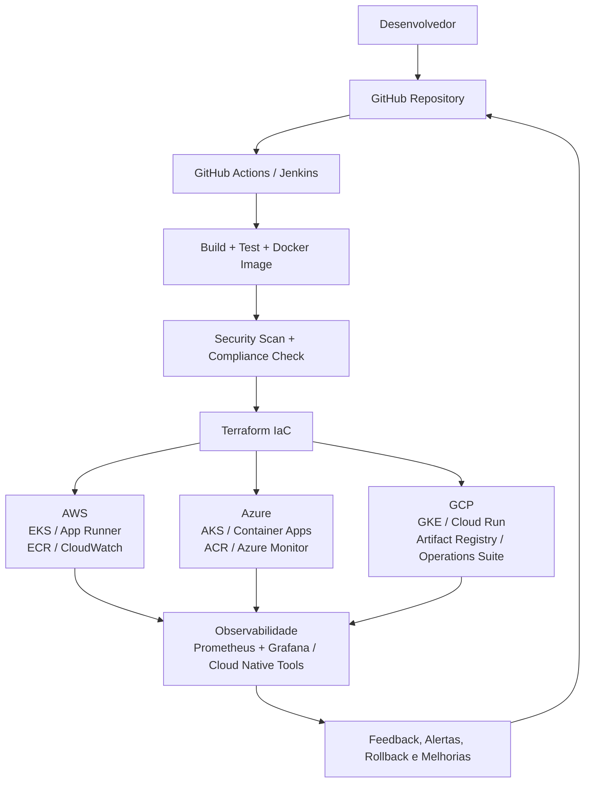

# Semana 09 – DevOps Pipeline

## Tema do Grupo

**Plataformas de Computação em Nuvem Aplicadas ao DevOps: Análise Comparativa entre AWS, Microsoft Azure e Google Cloud Platform**

## Grupo 05

**Integrantes:**

- Daniel Castilho de Oliveira
- Rian Karlos Silva Weber
- Ricardo de Almeida Sarruf

---

## 1. Objetivo da Entrega

Esta entrega apresenta um **pipeline DevOps conceitual** aplicado ao tema do grupo, considerando o uso de plataformas de computação em nuvem no contexto de práticas DevOps. A proposta foi construída com base nos artigos analisados pelo grupo e organiza, de forma comparativa, as principais etapas de um fluxo DevOps moderno em ambientes **AWS**, **Microsoft Azure** e **Google Cloud Platform (GCP)**.

O pipeline proposto segue a lógica geral:

> **Code → Build → Test → Security/Compliance → Infrastructure as Code → Integration → Deployment → Monitoring → Feedback**

A estrutura foi pensada para ambientes cloud-native, com uso de automação, containers, integração e entrega contínuas, provisionamento de infraestrutura por código, monitoramento contínuo e mecanismos de melhoria contínua.

---

## 2. Fundamentação dos Artigos para o Pipeline

A construção do pipeline não foi feita apenas com base em exemplos genéricos de DevOps. Cada artigo analisado contribuiu para definir uma etapa, uma preocupação técnica ou uma ferramenta relevante para o fluxo proposto.

| Nº | Artigo analisado | Principal achado utilizado no pipeline |
|---:|---|---|
| 1 | **Cloud-native DevOps Practices for SAP Deployment** | Evidenciou que práticas cloud-native, como **CI/CD**, **Docker**, **Kubernetes**, **microservices**, **IaC**, testes automatizados e monitoramento reduzem downtime, aumentam escalabilidade e melhoram a eficiência operacional. |
| 2 | **Comparing Major Cloud Providers for AI/ML Workloads: AWS vs Azure vs GCP** | Demonstrou que AWS, Azure e GCP seguem fluxos semelhantes de ingestão, processamento, treinamento, implantação e monitoramento, mas com ferramentas distintas. O artigo contribuiu para a análise comparativa de pipelines em nuvem. |
| 3 | **Accelerating Enterprise SAP Workload Performance and Automation Using Microsoft Azure Center for SAP Solutions** | Reforçou o papel da automação, do Azure DevOps, da orquestração inteligente e da infraestrutura como código para acelerar workloads empresariais e reduzir configurações manuais. |
| 4 | **Comparative Evaluation of Cloud-Native and VM-Based CI/CD Pipelines** | Serviu como base para diferenciar pipelines baseados em VMs de pipelines cloud-native. Mostrou que pipelines cloud-native utilizam serviços gerenciados, builds efêmeros, registries gerenciados e deploy automatizado. |
| 5 | **The Role of DevOps and Automation in Cloud Transition** | Organizou as categorias centrais de ferramentas DevOps: **IaC**, **CI/CD**, configuração, testes, deploy, monitoramento, segurança e compliance. Foi uma das principais bases para a sequência lógica do pipeline. |
| 6 | **Management of Self-Healing Systems for Multi-Cloud Deployments on Kubernetes** | Contribuiu com a ideia de implantação multi-cloud usando **Jenkins**, **Docker**, **Kubernetes**, registries de container e mecanismos de self-healing com monitoramento em tempo real. |
| 7 | **Adoption of Infrastructure as Code (IaC) in Real World** | Mostrou que IaC aumenta repetibilidade, transparência e automação da infraestrutura, justificando a inclusão de uma etapa específica de provisionamento por código. |
| 8 | **Infrastructure-as-Code with Scripting: A Technical Review** | Reforçou que Terraform, Ansible, scripts, GitOps e validações automatizadas são fundamentais para padronizar ambientes e evitar erros de configuração. |
| 9 | **Data Governance and Compliance in Cloud-Based Data Engineering Pipelines** | Contribuiu para a inclusão de uma etapa de segurança, governança e compliance, com verificação de criptografia, controle de acesso, auditoria, políticas e validações automatizadas. |
| 10 | **The Role of Software Developers in Transitioning On-Premises Applications to Cloud Platforms** | Evidenciou a importância dos desenvolvedores na migração para a nuvem, especialmente em refatoração, containerização, CI/CD, segurança, escalabilidade e otimização de custos. |
| 11 | **Cloud Enabled Intelligent Enterprise Healthcare Framework with Machine Learning Based on Artificial Intelligence and Blockchain Governance** | Reforçou a relevância de arquiteturas cloud-native seguras, escaláveis, governadas e auditáveis, especialmente em ambientes com dados sensíveis e requisitos regulatórios. |
| 12 | **Analyzing the System Features, Usability, and Performance of a Containerized Application on Cloud Computing Systems** | Comparou Cloud Run, AWS App Runner e Azure Container Apps, contribuindo para a etapa de implantação serverless/containerizada e para a análise de alternativas de deploy gerenciado. |

---

## 3. Premissas do Pipeline Conceitual

O pipeline foi estruturado considerando as seguintes premissas:

1. O código-fonte da aplicação e da infraestrutura deve estar versionado em repositório Git.
2. O processo de build deve ser automatizado e reproduzível.
3. A aplicação deve ser empacotada preferencialmente em container Docker.
4. Os testes devem ser executados antes de qualquer implantação em ambiente de homologação ou produção.
5. A infraestrutura deve ser provisionada por meio de **Infrastructure as Code (IaC)**.
6. A solução deve permitir comparação entre AWS, Azure e GCP.
7. O deploy deve ser automatizado, com possibilidade de estratégias como rolling update, blue/green ou canary.
8. O ambiente deve contar com monitoramento, logs, métricas, alertas e feedback contínuo.
9. Segurança e compliance devem ser tratados como etapas integradas ao pipeline, e não apenas como verificações finais.

---

## 4. Diagrama do Pipeline DevOps Conceitual

O diagrama abaixo representa o pipeline proposto para uma aplicação cloud-native executada em ambiente comparativo entre AWS, Azure e GCP.

```mermaid
flowchart LR
    A[Code<br/>Repositório Git] --> B[Build<br/>Compilação e dependências]
    B --> C[Containerização<br/>Imagem Docker]
    C --> D[Testes Automatizados<br/>Unitários, integração, API e carga]
    D --> E[Security & Compliance<br/>SAST, secrets, IaC scan, políticas]
    E --> F[IaC<br/>Terraform / CloudFormation / ARM / Deployment Manager]
    F --> G[Registry<br/>ECR / ACR / GCP Artifact Registry]
    G --> H[Integration / Staging<br/>Ambiente de homologação]
    H --> I[Validação<br/>Smoke tests e aprovação]
    I --> J[Deployment<br/>Produção em Kubernetes ou Serverless Containers]
    J --> K[Monitoring<br/>Logs, métricas, tracing e alertas]
    K --> L[Feedback<br/>Correções, rollback e melhoria contínua]
    L --> A

    J --> M[Self-Healing e Auto Scaling<br/>Kubernetes, HPA, health checks]
    M --> K
```

---

## 5. Descrição das Etapas do Pipeline

### 5.1 Code – Versionamento do Código

A primeira etapa consiste no armazenamento e controle de versão do código-fonte da aplicação, arquivos de configuração, manifests Kubernetes, scripts de automação e templates de infraestrutura.

**Finalidade:** garantir rastreabilidade, colaboração, histórico de alterações e possibilidade de rollback.

**Ferramentas possíveis:**

| Abordagem | Ferramentas |
|---|---|
| Genérica / multi-cloud | GitHub, GitLab, Bitbucket |
| AWS | AWS CodeCommit ou GitHub integrado |
| Azure | Azure Repos ou GitHub |
| GCP | Cloud Source Repositories ou GitHub |

**Resultado esperado:** código versionado e pronto para disparar o pipeline por meio de push, pull request ou merge na branch principal.

---

### 5.2 Build – Compilação e Preparação da Aplicação

Nesta etapa, o pipeline instala dependências, compila a aplicação, executa verificações iniciais e prepara o artefato para execução.

**Finalidade:** transformar o código-fonte em um artefato executável ou em uma aplicação pronta para empacotamento.

**Ferramentas possíveis:**

| Abordagem | Ferramentas |
|---|---|
| Genérica / multi-cloud | Jenkins, GitHub Actions, GitLab CI/CD |
| AWS | AWS CodeBuild |
| Azure | Azure Pipelines |
| GCP | Google Cloud Build |

**Resultado esperado:** aplicação compilada, dependências resolvidas e artefato pronto para testes e containerização.

---

### 5.3 Containerização – Criação da Imagem Docker

Após o build, a aplicação é empacotada em uma imagem Docker, permitindo portabilidade entre ambientes e provedores de nuvem.

**Finalidade:** padronizar o ambiente de execução, reduzir problemas de incompatibilidade e facilitar a implantação em Kubernetes ou serviços serverless baseados em containers.

**Ferramentas possíveis:**

- Docker
- Buildpacks
- Kaniko
- Dockerfile
- Cloud Build
- CodeBuild
- Azure Pipelines

**Resultado esperado:** imagem Docker versionada e identificada por tag, por exemplo: `app:v1.0.0`.

---

### 5.4 Testes Automatizados

A etapa de testes verifica se a aplicação funciona corretamente antes de seguir para integração e implantação.

**Finalidade:** reduzir falhas em produção, validar funcionalidades e detectar problemas de integração.

**Tipos de testes recomendados:**

| Tipo de teste | Finalidade | Ferramentas possíveis |
|---|---|---|
| Testes unitários | Validar funções e componentes isolados | JUnit, PyTest, Jest |
| Testes de integração | Verificar comunicação entre serviços | Postman/Newman, REST Assured |
| Testes de interface | Validar comportamento visual e fluxo do usuário | Selenium, Cypress |
| Testes de carga | Avaliar desempenho sob alto volume | JMeter, k6 |
| Smoke tests | Verificar se o sistema implantado está operacional | Scripts HTTP, Postman, curl |

**Resultado esperado:** relatório de testes aprovado. Caso algum teste falhe, o pipeline deve ser interrompido.

---

### 5.5 Security & Compliance – Segurança, Governança e Conformidade

Nesta etapa são aplicadas validações de segurança e conformidade antes da implantação.

**Finalidade:** impedir que vulnerabilidades, segredos expostos ou configurações inseguras sejam enviados para homologação ou produção.

**Verificações recomendadas:**

- Análise estática de código.
- Verificação de dependências vulneráveis.
- Escaneamento de imagens Docker.
- Detecção de segredos no repositório.
- Validação de templates IaC.
- Checagem de criptografia, tags obrigatórias e políticas de acesso.
- Validação de permissões IAM/RBAC.

**Ferramentas possíveis:**

| Categoria | Ferramentas |
|---|---|
| Secrets | HashiCorp Vault, AWS Secrets Manager, Azure Key Vault, GCP Secret Manager |
| Segurança de container | Snyk, Trivy, Aqua Security |
| Compliance cloud | AWS Config, Azure Policy, Google Cloud Policy Intelligence/Forseti |
| IaC scan | Checkov, tfsec, Terrascan |
| Auditoria | AWS CloudTrail, Azure Monitor, Google Cloud Audit Logs |

**Resultado esperado:** somente artefatos e configurações aprovados em segurança seguem para provisionamento e deploy.

---

### 5.6 Infrastructure as Code – Provisionamento da Infraestrutura

A infraestrutura necessária para executar a aplicação é criada por código, de forma automatizada, versionada e reproduzível.

**Finalidade:** evitar configuração manual, reduzir inconsistências entre ambientes e permitir replicação em AWS, Azure e GCP.

**Ferramentas possíveis:**

| Abordagem | Ferramentas |
|---|---|
| Multi-cloud | Terraform, Pulumi |
| AWS | CloudFormation, AWS CDK |
| Azure | ARM Templates, Bicep |
| GCP | Deployment Manager |
| Configuração | Ansible |

**Recursos provisionados:**

- Redes virtuais.
- Clusters Kubernetes.
- Serviços serverless.
- Bancos de dados.
- Registries de container.
- Regras de segurança.
- Políticas de acesso.
- Observabilidade e alertas.

**Resultado esperado:** ambiente de homologação ou produção provisionado de forma padronizada.

---

### 5.7 Registry – Armazenamento da Imagem

A imagem Docker aprovada é enviada para um registro de containers.

**Finalidade:** armazenar, versionar e disponibilizar imagens para implantação automatizada.

**Ferramentas por provedor:**

| Provedor | Registry |
|---|---|
| AWS | Amazon Elastic Container Registry (ECR) |
| Azure | Azure Container Registry (ACR) |
| GCP | Google Artifact Registry |
| Multi-cloud | Docker Hub, GitHub Container Registry, Harbor |

**Resultado esperado:** imagem disponível no registry para ser consumida pelo ambiente de deploy.

---

### 5.8 Integration / Staging – Homologação

Antes da produção, a aplicação é implantada em ambiente de integração ou homologação.

**Finalidade:** validar comportamento real da aplicação em ambiente semelhante ao de produção.

**Atividades realizadas:**

- Deploy em ambiente temporário ou de staging.
- Execução de smoke tests.
- Testes de integração com APIs, banco de dados e serviços externos.
- Validação de performance inicial.
- Verificação de logs e métricas.
- Aprovação manual ou automática para produção.

**Resultado esperado:** aplicação validada e aprovada para implantação em produção.

---

### 5.9 Deployment – Implantação em Produção

A implantação em produção ocorre após a aprovação dos testes, das validações de segurança e da homologação.

**Finalidade:** disponibilizar a nova versão da aplicação ao usuário final com o menor risco possível.

**Estratégias recomendadas:**

| Estratégia | Descrição |
|---|---|
| Rolling update | Atualiza gradualmente as instâncias da aplicação. |
| Blue/Green | Mantém dois ambientes e alterna o tráfego entre eles. |
| Canary | Libera a nova versão para uma pequena parcela dos usuários antes da liberação total. |
| Rollback automatizado | Retorna para a versão anterior em caso de falha. |

**Opções de deploy por provedor:**

| Provedor | Kubernetes | Serverless Containers | Outros serviços |
|---|---|---|---|
| AWS | Amazon EKS | AWS App Runner | CodeDeploy, ECS |
| Azure | Azure Kubernetes Service (AKS) | Azure Container Apps | Azure App Service |
| GCP | Google Kubernetes Engine (GKE) | Cloud Run | Cloud Deploy |

**Resultado esperado:** nova versão da aplicação publicada com rastreabilidade e possibilidade de rollback.

---

### 5.10 Monitoring – Monitoramento e Observabilidade

Após a implantação, o sistema deve ser monitorado continuamente para identificar falhas, lentidão, indisponibilidade ou comportamento anormal.

**Finalidade:** garantir confiabilidade, desempenho, disponibilidade e suporte à melhoria contínua.

**Métricas recomendadas:**

| Categoria | Métricas |
|---|---|
| Disponibilidade | Uptime, taxa de erro, health checks |
| Performance | Latência, tempo de resposta, throughput |
| Infraestrutura | CPU, memória, armazenamento, rede |
| Deploy | Frequência de implantação, falhas em deploy, tempo de recuperação |
| Segurança | Tentativas de acesso indevido, violações de política, alertas de vulnerabilidade |
| Custo | Consumo de recursos, uso ocioso, custo por ambiente |

**Ferramentas possíveis:**

| Abordagem | Ferramentas |
|---|---|
| Multi-cloud | Prometheus, Grafana, Datadog, New Relic |
| AWS | Amazon CloudWatch |
| Azure | Azure Monitor |
| GCP | Google Cloud Operations Suite |

**Resultado esperado:** dashboards, alertas e relatórios que alimentem decisões técnicas e novas melhorias no pipeline.

---

### 5.11 Feedback, Rollback e Melhoria Contínua

A etapa final fecha o ciclo DevOps, retornando dados de operação para o time de desenvolvimento.

**Finalidade:** transformar informações de produção em melhorias de código, infraestrutura, segurança e performance.

**Atividades recomendadas:**

- Abertura automática de issues em caso de falhas.
- Rollback em caso de degradação severa.
- Revisão de métricas DORA.
- Ajuste de recursos e custos.
- Otimização de autoscaling.
- Atualização de regras de segurança e compliance.
- Correção de bugs e reinício do ciclo pelo repositório Git.

**Resultado esperado:** ciclo contínuo de melhoria baseado em dados reais de operação.

---

## 6. Pipeline Comparativo entre AWS, Azure e GCP

| Etapa | AWS | Microsoft Azure | Google Cloud Platform |
|---|---|---|---|
| Código | CodeCommit ou GitHub | Azure Repos ou GitHub | Cloud Source Repositories ou GitHub |
| Orquestração CI/CD | CodePipeline, Jenkins, GitHub Actions | Azure Pipelines, GitHub Actions | Cloud Build, GitHub Actions |
| Build | CodeBuild | Azure Pipelines | Cloud Build |
| Containerização | Docker + CodeBuild | Docker + Azure Pipelines | Docker + Cloud Build |
| Registry | Amazon ECR | Azure Container Registry | Artifact Registry |
| IaC | CloudFormation, CDK, Terraform | ARM, Bicep, Terraform | Deployment Manager, Terraform |
| Kubernetes | Amazon EKS | Azure Kubernetes Service (AKS) | Google Kubernetes Engine (GKE) |
| Serverless container | AWS App Runner | Azure Container Apps | Cloud Run |
| Segurança e segredos | IAM, Secrets Manager, KMS, AWS Config | Azure AD, Key Vault, Azure Policy | IAM, Secret Manager, Cloud KMS |
| Monitoramento | CloudWatch | Azure Monitor | Cloud Operations Suite |
| Governança de dados | Lake Formation, Glue Data Catalog | Microsoft Purview | Data Catalog |
| Estratégia de deploy | CodeDeploy, blue/green, canary | Azure Pipelines, deployment slots, canary | Cloud Deploy, rolling/canary |

---

## 7. Pipeline Recomendado para o Tema do Grupo

Considerando que o tema do grupo é uma análise comparativa entre **AWS, Azure e GCP**, recomenda-se um pipeline com arquitetura **multi-cloud e vendor-neutral**, utilizando ferramentas que funcionem nos três provedores, sem impedir o uso de serviços nativos quando necessário.

### 7.1 Ferramentas principais recomendadas

| Camada | Ferramenta recomendada | Justificativa |
|---|---|---|
| Versionamento | GitHub | Funciona de forma integrada com AWS, Azure e GCP. |
| CI/CD | GitHub Actions ou Jenkins | Permite execução de pipelines multi-cloud e integração com diferentes provedores. |
| Containerização | Docker | Padroniza a aplicação e facilita portabilidade. |
| IaC | Terraform | Possui suporte maduro para AWS, Azure e GCP. |
| Orquestração | Kubernetes | Reduz dependência de fornecedor e facilita deploy multi-cloud. |
| Deploy GitOps | Argo CD | Permite entrega contínua declarativa em clusters Kubernetes. |
| Observabilidade | Prometheus + Grafana | Solução aberta, amplamente usada em Kubernetes e multi-cloud. |
| Segurança | Vault, Snyk/Trivy, políticas cloud-native | Protege segredos, containers e infraestrutura. |

---

## 8. Diagrama de Arquitetura Multi-Cloud

---

## 9. Exemplo de Fluxo Prático

Um fluxo prático para o pipeline poderia ocorrer da seguinte forma:

1. O desenvolvedor realiza alteração no código e envia para o GitHub.
2. O push ou pull request dispara automaticamente o pipeline.
3. O pipeline executa build, instala dependências e valida o código.
4. A aplicação é empacotada em uma imagem Docker.
5. São executados testes unitários, integração, API e carga.
6. A imagem e os templates de infraestrutura passam por análise de segurança.
7. O Terraform provisiona ou atualiza a infraestrutura nos provedores definidos.
8. A imagem é enviada ao registry correspondente.
9. A aplicação é implantada em homologação.
10. Após validação, ocorre o deploy em produção.
11. O sistema é monitorado por ferramentas de observabilidade.
12. Em caso de erro, o pipeline permite rollback ou abertura de nova tarefa para correção.

---

## 10. Indicadores para Avaliação do Pipeline

Para avaliar a eficiência do pipeline, recomenda-se o uso de métricas técnicas e operacionais.

| Indicador | Finalidade |
|---|---|
| Frequência de deploy | Medir quantas vezes a equipe consegue entregar novas versões. |
| Lead time for changes | Medir o tempo entre uma alteração de código e sua chegada à produção. |
| Change failure rate | Medir o percentual de implantações que causam falhas. |
| Mean Time to Recovery (MTTR) | Medir o tempo médio de recuperação após falha. |
| Tempo de build | Avaliar eficiência da etapa de compilação. |
| Tempo de execução dos testes | Avaliar gargalos na validação automatizada. |
| Latência da aplicação | Medir desempenho percebido pelo usuário. |
| Uptime | Medir disponibilidade do serviço. |
| Custo por ambiente | Controlar gastos em homologação e produção. |
| Vulnerabilidades detectadas | Medir segurança do código, containers e infraestrutura. |

---

## 11. Riscos e Controles

| Risco | Impacto | Controle recomendado |
|---|---|---|
| Vendor lock-in | Dependência excessiva de um único provedor | Uso de Terraform, Docker, Kubernetes e padrões abertos. |
| Falhas de configuração | Ambientes inconsistentes ou inseguros | IaC com revisão por pull request e validação automatizada. |
| Segredos expostos | Vazamento de credenciais | Uso de Vault, Secrets Manager, Key Vault ou Secret Manager. |
| Deploy com falha | Indisponibilidade da aplicação | Estratégias canary, blue/green e rollback automatizado. |
| Ausência de monitoramento | Falhas não detectadas rapidamente | Prometheus, Grafana, CloudWatch, Azure Monitor e Operations Suite. |
| Custos elevados | Uso ineficiente de recursos cloud | Autoscaling, desligamento automático e análise de custos. |
| Não conformidade | Problemas regulatórios e de auditoria | Políticas automatizadas, logs, criptografia e auditoria contínua. |

---

## 12. Conclusão

O pipeline DevOps conceitual proposto demonstra que AWS, Microsoft Azure e Google Cloud Platform oferecem recursos suficientes para a implementação de fluxos modernos de integração, entrega, implantação e monitoramento contínuos. Embora cada provedor possua ferramentas nativas próprias, o uso de tecnologias como **Git**, **Docker**, **Terraform**, **Kubernetes**, **Jenkins/GitHub Actions**, **Prometheus** e **Grafana** permite maior portabilidade e reduz a dependência de um único fornecedor.

Com base nos artigos analisados, observa-se que pipelines cloud-native tendem a reduzir esforço manual, aumentar a rastreabilidade, melhorar a escalabilidade, fortalecer a segurança e acelerar a entrega de software. Dessa forma, para o tema do grupo, a abordagem mais adequada é um pipeline híbrido: **vendor-neutral na arquitetura central** e **adaptável às ferramentas nativas de cada provedor** quando houver ganho de integração, desempenho ou governança.

---

## 13. Referências Utilizadas

1. RAVI, Vamsee Krishna et al. **Cloud-native DevOps Practices for SAP Deployment**. International Journal of Research in Modern Engineering and Emerging Technology, 2022.
2. GADEKAR, Amruta et al. **Comparing Major Cloud Providers for AI/ML Workloads: AWS vs Azure vs GCP**. International Journal of Advanced Research in Education and Technology, 2024.
3. JOYCE, Sheetal. **Accelerating Enterprise SAP Workload Performance and Automation Using Microsoft Azure Center for SAP Solutions Through Cloud Native Architecture Intelligent Orchestration and Infrastructure as Code**. IACSE International Journal of Information Technology, 2023.
4. BANERJEE, Rahul; CHATTERJEE, Tathagata. **Comparative Evaluation of Cloud-Native and VM-Based CI/CD Pipelines for Automated DevOps Deployments**. Asian Journal of Research in Computer Science, 2025.
5. KISHAN, Raj. **The Role of DevOps and Automation in Cloud Transition**. International Journal of Computer Technology and Electronics Communication, 2022.
6. DESHPANDE, Vaishnavi Udayrao. **Management of Self-Healing Systems for Multi-Cloud Deployments on Kubernetes**. National College of Ireland, 2024.
7. MURPHY, Olga. **Adoption of Infrastructure as Code (IaC) in Real World: Lessons and Practices from Industry**. JAMK University of Applied Sciences, 2022.
8. VELDI, Santhosh Rao. **Infrastructure-as-Code with Scripting: A Technical Review**. Journal of Computer Science and Technology Studies, 2025.
9. PASHIKANTI, Santosh. **Data Governance and Compliance in Cloud-Based Data Engineering Pipelines**. International Journal of Leading Research Publication, 2024.
10. BALADARI, Venkata. **The Role of Software Developers in Transitioning On-Premises Applications to Cloud Platforms: Strategies and Challenges**. Journal of Scientific and Engineering Research, 2021.
11. GUJJALA, Praveen Kumar Reddy. **Cloud Enabled Intelligent Enterprise Healthcare Framework with Machine Learning Based on Artificial Intelligence and Blockchain Governance**. International Journal of Research Publications in Engineering, Technology and Management, 2025.
12. ABRAHAM, Anoop. **Analyzing the System Features, Usability, and Performance of a Containerized Application on Cloud Computing Systems**. Texas A&M University-San Antonio, 2023.
